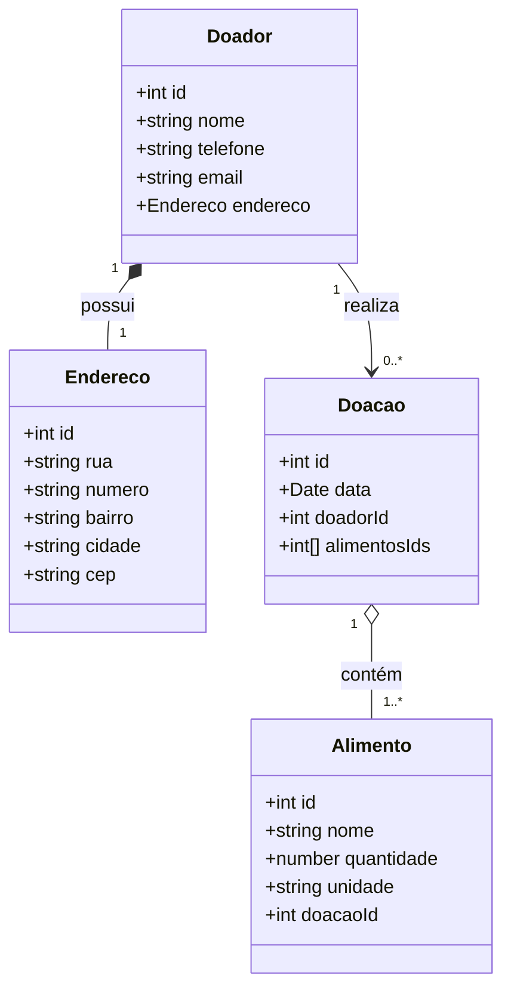
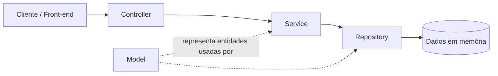

# Diagrama UML — Cesta Solidária

Diagrama de classes mostrando o relacionamento entre os objetos do sistema.
O GitHub renderiza blocos ` ```mermaid ` automaticamente na visualização do `.md`.



## Regras de relacionamento

1. **Doador → Endereco (1:1 — composição):** todo Doador possui exatamente um Endereço, criado junto com o cadastro do doador.
2. **Doador → Doacao (1:N):** um Doador pode realizar uma ou várias Doações. Cada Doação referencia um único `doadorId`.
3. **Doacao → Alimento (1:N):** uma Doação contém um ou vários Alimentos. Cada Alimento vinculado guarda o `doacaoId` da doação à qual pertence.

## Fluxo entre camadas (arquitetura)



- **Controller** recebe a requisição HTTP e delega para o Service.
- **Service** aplica as regras de negócio (validações, verificação de relacionamentos).
- **Repository** é o único ponto que acessa/gerencia os dados.
- **Model** representa as entidades (`Doador`, `Endereco`, `Doacao`, `Alimento`) usadas por todas as camadas.
